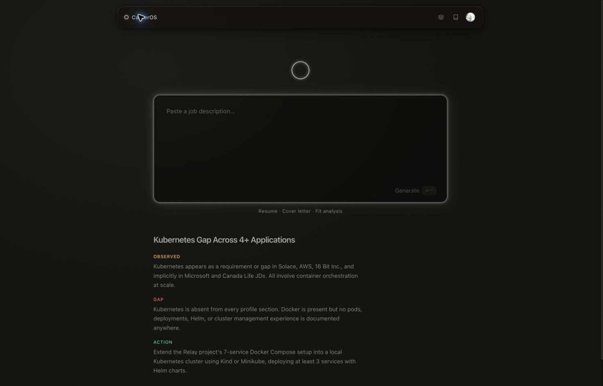
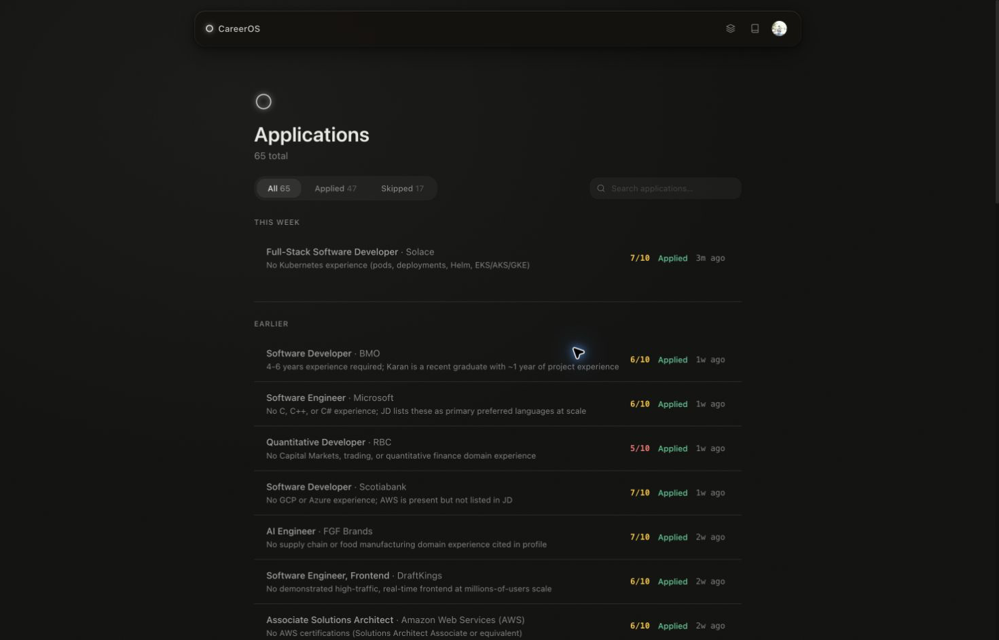
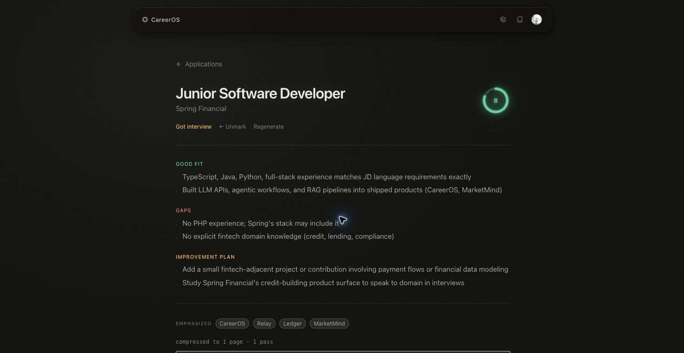
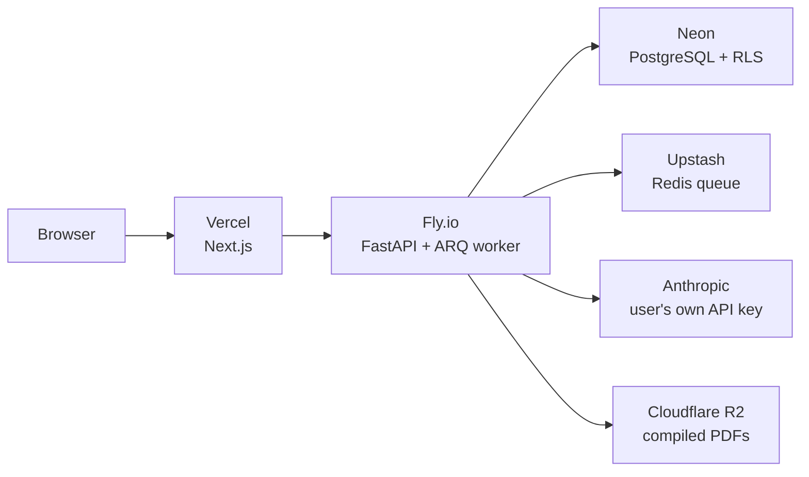

# CareerOS

Paste a job description. In about twenty seconds, get back a resume and a cover letter written specifically for that role — not reworded from a template, built from a career history the system actually understands.



<br>

## The problem

Tailoring a resume for a single posting takes real work: rereading the description, deciding which two or three projects actually matter for it, rewriting bullets so the numbers and keywords line up, writing a cover letter that doesn't sound like every other cover letter. A real job search means doing that dozens of times. Most people stop doing it carefully somewhere around the fifth application, and stop doing it at all somewhere around the fifteenth.

The common workaround is a general chat window: paste your background, paste the posting, ask for a resume, edit what comes back, ask again next time. It works. It also means re-explaining who you are, from scratch, for every single application.

CareerOS removes the re-explaining. A person's background lives in the system once. Every generation starts from there.

<br>

## How it works, from the outside

Open the app. Paste a job description. One key combination. Wait roughly twenty seconds. Read a short, specific read on the fit. Download a resume and a cover letter, both compiled to PDF, both built for that posting. Move to the next application.

After one-time setup of an API key, profile, and resume format, there is no dashboard to manage and no prompt to compose. During the application loop the interface has exactly one job, and it does nothing else while the user is in it.

<br>

## Why it isn't just a resume generator

Every generation starts from the same persistent source of truth. CareerOS keeps a structured model of a person's work — companies, roles, projects, skills, education — not a resume file, but the underlying facts a resume gets assembled from. A versioned evidence index is rebuilt only when that profile changes. For each posting, the system selects the few facts that matter, writes against their source IDs, and lets code control names, dates, structure, LaTeX, and the one-page limit.

The same structure lets the system notice things a single resume never could. After enough applications, CareerOS looks across their stored evidence and surfaces one repeated gap worth fixing before the next application. That insight is deterministic and costs no additional AI call — not a dashboard of counts to feel good about.



It also doesn't get quietly more expensive to run the more it's used. Every generation runs on the user's own AI provider key, encrypted at rest, never shared, never billed to anyone but its owner. CareerOS owns the workflow. Each person owns their own usage.



<br>

---

<br>

*Everything below this line is about how CareerOS is built, not what it does. The [stack](#built-with) and [local setup](#running-it-locally) are further down if that's what brought you here.*

<br>

## Under the hood



**Every user's data is isolated by the database, not just by application code.**
Most multi-tenant systems enforce "your data, not theirs" entirely in application code — a `WHERE user_id = …` clause that has to be remembered, correctly, on every query, forever, by everyone who ever touches the codebase. One missed clause is a data leak. CareerOS enforces isolation at the database itself: every user-scoped table runs under Postgres row-level security, forced on, tied to a value set once per request, through a database role that has no ability to bypass it. Postgres exempts superusers from row-level security unconditionally, so the role that actually handles requests deliberately isn't one. The application-layer checks still exist. Row-level security is what holds if one of them is ever wrong.

**The AI provider is a seam, not a dependency baked into the business logic.**
Generation code calls a provider interface rather than coupling business logic to the Anthropic client. The same pattern repeats for PDF storage and the single transactional email trigger: account-deletion confirmation. Changing providers, or adding a second one, is a new implementation of an existing interface — not a rewrite of everything that calls it.

**Generation survives the request that started it.**
A resume call can run long enough that it doesn't belong inside the request that triggered it. CareerOS immediately creates a job record, enqueues the work in Redis, and consumes it through an ARQ worker hosted alongside the API. The browser polls the persisted job rather than holding an HTTP request open, so a restart does not turn a slow generation into a lost response.

**The output is typeset, not approximated.**
Resumes aren't styled HTML printed to PDF. They're assembled as LaTeX and compiled with Tectonic, in a fresh, sandboxed subprocess per request, with a stripped environment that never has access to a database credential or an API key. The document that comes out the other end is the same class of artifact a person who cared about kerning would produce by hand, because it's actually typeset.

**It was reviewed before it was trusted with anyone else's data.**
Before extending access past its own author, CareerOS went through a full security review — authentication, authorization, secrets handling, upload safety, subprocess isolation — treating every earlier assumption as unproven and re-checking it against the code as it actually exists today. What the review found, and what came out of fixing it, is part of the project's history, not something smoothed over.

<br>

## Built with

| | |
|---|---|
| **Frontend** | Next.js (App Router), React, Tailwind, Framer Motion |
| **Backend** | FastAPI, async Python |
| **Database** | PostgreSQL, row-level security, SQLAlchemy |
| **Auth** | Clerk |
| **AI** | Claude (Anthropic), behind a swappable provider interface |
| **Job queue** | ARQ + Redis |
| **Document generation** | LaTeX, compiled with Tectonic |
| **Object storage** | Cloudflare R2 |
| **Hosting** | Fly.io (API + in-process ARQ worker), Vercel (frontend), Neon (Postgres), Upstash (Redis) |
| **Observability** | Structured JSON logging, Sentry |

<br>

## Running it locally

<details>
<summary><strong>Setup instructions</strong></summary>

<br>

Requires Python 3.12+, Node 20+, a Postgres instance, a Redis instance, and a Clerk application. Add an Anthropic API key through Settings after signing in; CareerOS has no shared generation key.

```bash
git clone https://github.com/karansidhu3/Career-OS.git
cd Career-OS

# Backend
cd backend
python -m venv venv && source venv/bin/activate
pip install -r requirements.txt
cp .env.example .env   # DATABASE_URL, CLERK_*, ENCRYPTION_MASTER_KEY
uvicorn app.main:app --reload
# Starts the API and its in-process ARQ worker.

# Frontend — separate terminal
cd frontend
npm install
cp .env.local.example .env.local   # Clerk keys
npm run dev
```

Every user supplies their own Anthropic key through the interface after signing in. There's no shared key to configure, by design.

</details>

<br>

---

<br>

CareerOS started as a tool built to fix one person's own job search. It's still used that way — by the person who built it, on every application he sends. That's the standard it's actually held to: not a feature roadmap, but whether it makes the next application meaningfully better than doing it by hand.
